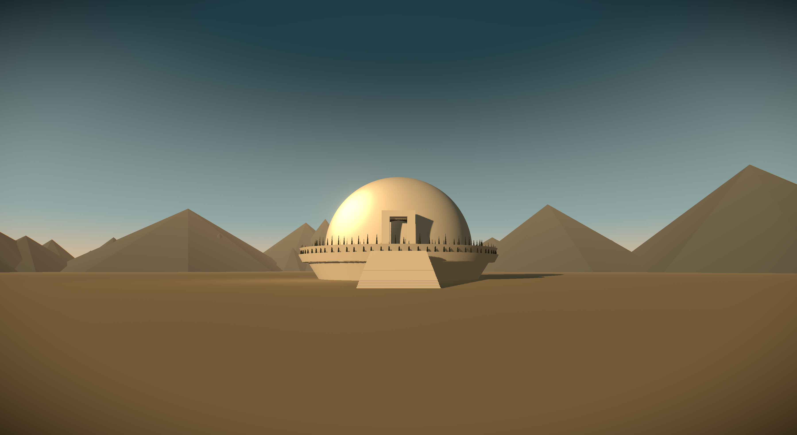
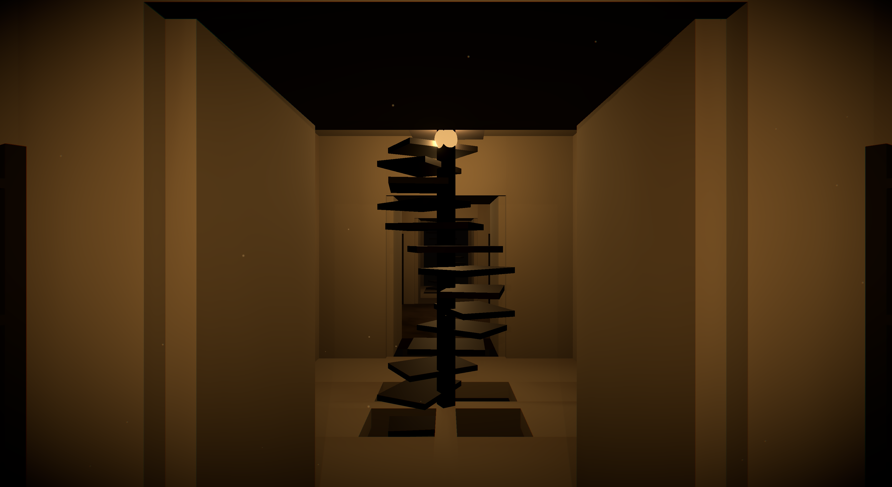
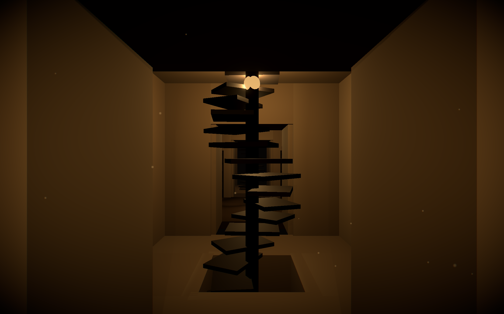
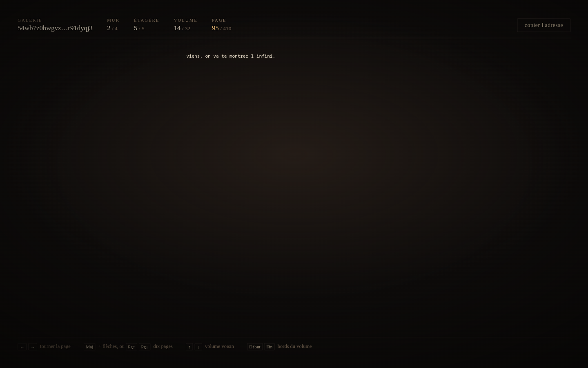

# Babbel

**La Bibliothèque de Babel de Borges, visitable dans le navigateur.**



Chaque livre (410 pages, 40 lignes, 80 caractères, 25 symboles) est calculé au
moment où vous tournez la page, par une bijection déterministe entre une adresse
dans la bibliothèque et son contenu. Rien n'est stocké nulle part : il y a
25^1 312 000 livres possibles, soit un nombre à plus de 1,8 million de chiffres.

| Une salle des livres | Le zaguán et sa trémie | La recherche |
|---|---|---|
|  |  |  |

La troisième image est le cœur du projet : on écrit une phrase, et le site
calcule **où** elle se trouve. La bijection s'inverse, donc « viens, on va te
montrer l'infini » a une adresse, une seule, et l'ouvrir la retrouve au
caractère près.

## L'idée technique

Le problème n'est pas de dessiner une bibliothèque, il est de la rendre infinie
sans rien stocker.

- **Aucun serveur, aucune base de données.** Le contenu d'une page est une
  fonction pure de son adresse. Il n'y a rien à héberger d'autre que des
  fichiers statiques.
- **La bijection opère à l'échelle de la page**, pas du livre : 3 200 caractères
  font 14 861 bits en `BigInt`, quand un livre entier en ferait 6,1 millions,
  trop lourd pour une frame.
- **Elle est inversible**, ce qui donne la recherche par texte gratuitement.
  L'algorithme retenu est le *cycle walking* plutôt qu'un générateur masqué :
  plus simple à prouver correct, et sans cas particulier.
- **Tout le calcul vit dans un Web Worker.** Le fil de rendu ne calcule jamais.
  Cent tournages de page ne bloquent le fil principal que 2,80 ms au total,
  soit 17 % du budget d'**une seule** image.
- **Rien n'est téléchargé** : ni texture, ni police, ni son. Le ciel, le marbre,
  la poussière et le bourdon d'ambiance sont synthétisés dans le navigateur.
- **L'adresse vit dans le fragment de l'URL**, qui n'est jamais envoyé au
  serveur. L'hébergeur ne peut donc pas savoir ce que vous lisez.

**Le site est dessiné, pas modélisé** (voir [décision D62](docs/DECISIONS.md)).
Le moteur 3D pesait 1,1 Mo sur 1,3, et la première illustration dessinée a
dépassé en une heure ce que trois jours de rendu n'avaient pas atteint. Les 640
volumes d'une galerie sont calculés, dessinés et cliquables, chacun portant son
adresse : le placement reste un problème de géométrie pure, dans un module pur
et testé.

## Démarrer

```sh
npm install
npm run dev       # développement
npm run check     # types, style et 174 tests
npm run build     # produit dist/
```

Ajouter `?sonde` à l'URL installe les fonctions de mesure (`__babbelBench`,
`__babbelStep`) sur une construction de production.

## Vérification

`npm run check` enchaîne le typage, le style et **174 tests**, tous verts. Le
plus important d'entre eux tient en une ligne :

```ts
expect(inverse(forward(x))).toBe(x)
```

S'il tombe, tout le reste est faux. Il vit dans
[`src/core/__tests__/bijection.test.ts`](src/core/__tests__/bijection.test.ts).

Le cœur (`src/core/`) est du TypeScript pur : aucune dépendance à React, donc
testable sans navigateur. Le placement des 640 volumes est écrit en
mathématiques pures dans `vue2d/perspective.ts`, ce qui est la seule façon de
vérifier qu'aucune adresse ne manque et qu'aucune n'apparaît deux fois.

## Déployer

Le site est **entièrement statique**. Il suffit de servir `dist/`.

Aucune réécriture de route n'est nécessaire : l'adresse d'une page vit dans le
fragment de l'URL (voir [décision D20](docs/DECISIONS.md)), et un fragment ne
quitte jamais le navigateur. N'importe quel hébergeur statique convient, de
Vercel à un simple `nginx`.

```sh
npm run build && npx vercel deploy --prod dist
```

Tout le site tient en **232 Ko**, worker compris. Il n'y a plus de moteur 3D à
charger, et donc plus rien à charger en différé.

## État

Les sept phases prévues sont terminées, les chantiers restants aussi, et
l'audit qui a suivi est corrigé, y compris une régression de performance à
19,45 ms par image ramenée à 6,44 ms. Ce qui reste ouvert est listé en fin de
[`docs/ROADMAP.md`](docs/ROADMAP.md).

## Documentation

| Fichier | Contenu |
|---|---|
| [`docs/RECHERCHE.md`](docs/RECHERCHE.md) | Les faits sourcés : Borges, l'algorithme, les limites du navigateur |
| [`docs/ARCHITECTURE.md`](docs/ARCHITECTURE.md) | Pile technique, arborescence, modèle de données, budget de performance |
| [`docs/DECISIONS.md`](docs/DECISIONS.md) | Chaque choix structurant et sa raison, 59 décisions |
| [`docs/ROADMAP.md`](docs/ROADMAP.md) | Les phases et ce qui reste |
| [`docs/PLAN-ESTHETIQUE.md`](docs/PLAN-ESTHETIQUE.md) | La reprise du rendu : le constat mesuré, les phases et leurs critères |
| [`docs/DIRECTION-ARTISTIQUE.md`](docs/DIRECTION-ARTISTIQUE.md) | Palette, formes, matériaux, post-traitement |

## Licence

MIT, voir [`LICENSE`](LICENSE).

La direction artistique s'est appuyée sur la vidéo *« Viens, je vais te
Montrer l'Infini »*, dont les images ne sont pas reproduites ici : ce qu'on en
a retenu est décrit en mots dans
[`docs/DIRECTION-ARTISTIQUE.md`](docs/DIRECTION-ARTISTIQUE.md).
